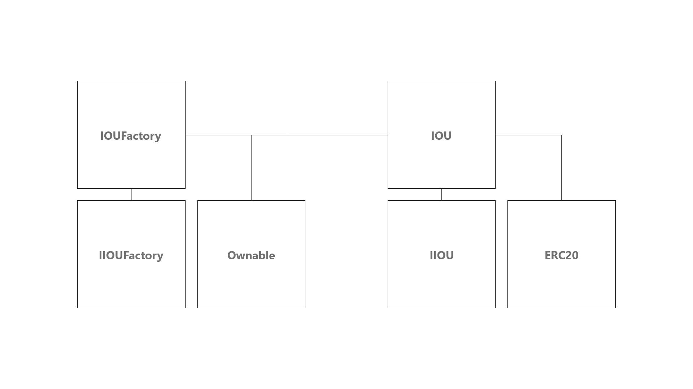

# Cross-Chain IOUs 



Powering the functionality of trusted cross-chain payments, IOUs stand as an on-chain representation for an asset owed. Offered by the token distributor, a signature is enforced to provide an opportunity that all tokens minted have funds to be redeemed against.

> This system utilizes a trusted party to provide the IOU, and is not a decentralized solution.

## Building

The dependencies for IOUs are very slim. To install all that is needed, run:

```bash
npm install
```

## Testing

This repository is setup to use [Hardhat](https://hardhat.org/), a development environment to compile, deploy, test, and debug your Ethereum software. It helps developers manage and automate the recurring tasks that are inherent to the process of building smart contracts and dApps, as well as easily introducing more functionality around this workflow.

To install the dependencies, run the tests and prepare for development, run:

```bash
npx hardhat test
```

## Deploying 

To deploy the project to a local network, run:

```bash
npx hardhat deploy --network localhost
```

To deploy the project to a live network, first configure your `.env` based on `example.env` and then run:

```bash
npx hardhat deploy --network polygon
```

## 